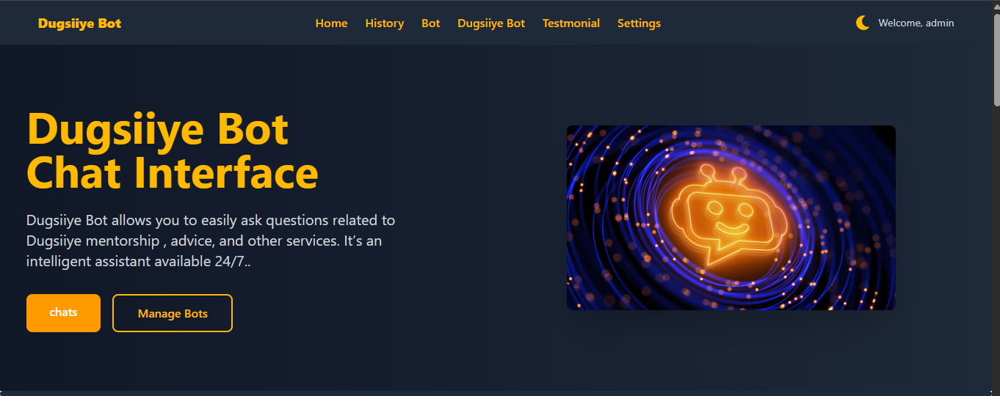

# 🟡 Dugsiiye – Smart Assistant for Students

**ChatUi** waa web app fudud oo kaa caawinaya inaad si sahlan uga hesho jawaabo degdeg ah oo ku saabsan dugsiga, gaar ahaan casharrada macallimiintu dhigaan. Waa chatbot waxbarasho u gaar ah oo loogu talagalay ardayda.

---

## 🧠 Waa maxay Dugsiiye qabto?

- Kuu oggolaanaya inaad weydiiso su'aalo la xiriira:
  - Maadooyinka dugsiga
  - Casharro muhiim ah
  - Talooyin waxbarasho
  - Qodobo muhiim u ah fahamka
- Waxaad la sheekeysan kartaa Bot-ka si fudud adigoo ku jira web app-ka
- Waa mid responsive ah, waxaana uu ku shaqeeyaa mobile iyo desktop

---

## 🌍 Homepage View (Mockup)

- Navigation bar leh: Home | History | Bot | Chatpage | Users | Settings
- Midabyo u eg classroom & smart interface
- Bot assistant oo leh input iyo conversation log
- Sign In / Sign Up buttons  


---

## ✨ Key Features

- 🤖 **AI Chatbot**: Caawiye xog ogaal ah oo su'aalahaaga ku saabsan casharada si degdeg ah uga jawaaba.

- 🔐 **Supabase Authentication**: Isdiiwaangelin iyo galitaan ammaan ah oo fudud.
- 🌙 **Dark/Light Mode Toggle**: Doorashada muuqaalka habeen ama maalin si fudud.
- 📱 **Mobile Responsive**: Si fiican ayuu uga shaqeeyaa qalab kasta — mobile, tablet, iyo desktop.
- 🧠 **Mentorship Awareness**: Warbixin iyo talooyin ku saabsan barnaamijka Dugsiiye Mentorship.
- 🛠️ **Easy Setup & Deployment**: Mashruuc fudud in la isticmaalo iyo in la host-gareeyo.
- 🧩 **Local Chat History**: Taariikhda sheekadaada oo si ammaan ah loogu kaydiyo browser-kaaga.
- 🌐 **Live Preview**: Netlify/Vercel waxay kuu ogolaanayaan inaad si toos ah u tijaabiso app-ka.

---

## 🛠️ Tech Stack

| Qeybta            | Teknoolojiyada la adeegsaday           |
|-------------------|----------------------------------------|
| **Frontend**      | React.js                               |
| **Styling**       | Tailwind CSS                           |
| **API**           | OpenRouter API (Chat Assistant)        |
| **Authentication**| Supabase                               |
| **Routing**       | React Router DOM                       |
| **Deployment**    | Vite + Netlify/Vercel                  |

---

## 🔧 Sida loo socodsiiyo mashruuca (Local Setup)

```bash
# 1. Clone the repo
git clone https://github.com/star-ELmi/ChatUi.git
cd ChatUi

# 2. Install dependencies
npm install

# 3. Run project with Vite
npm run dev
